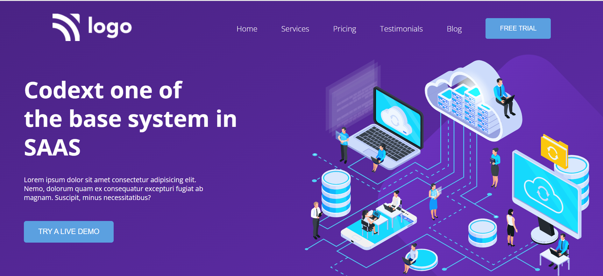

# Project 13 
[Live](https://saas-landing-fsjs.netlify.app/)

### Time taken to finish this project
3 Hours

### Skills Gained
To make website responsive by using media queries.

## Saas Landing Page
### This project is developed as part of Full Stack Javascript bootcamp